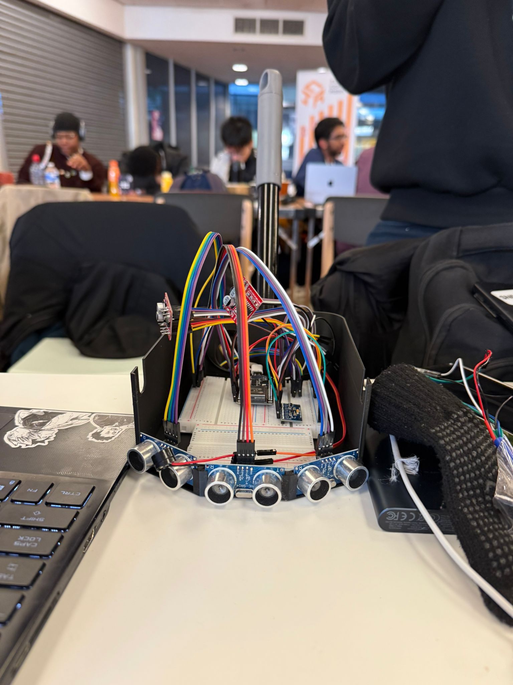

# SeeTrue

This is for the ICHack 2025 hackathon. This project placed first in the Hardware Category. 

SeeTrue is an AI-powered hardware tool, which visually impaired users can attach to a white cane to get more information about their surroundings.

## Features

- Uses Camera and Ultrasonic Sensors to scan surroundings, and detect obstacles
- Dynamically generates map of surroundings using SLAM (Simultaneous Localisation and Mapping)
- Provides haptic feedback to users based on proximity to obstacles 

## Demo

https://github.com/user-attachments/assets/c1797844-fdbd-47da-a41b-f5b804eae608

